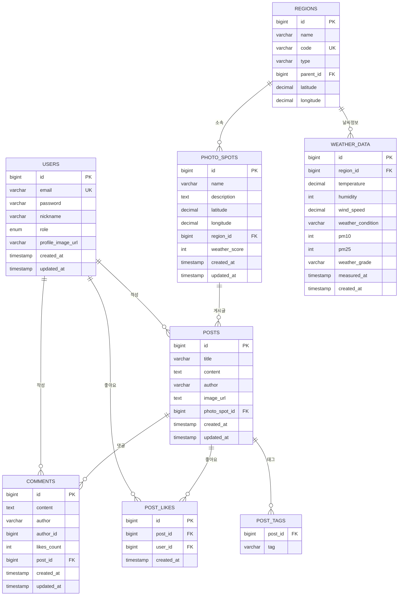

# WebFroPhto 🌤️📸

**날씨와 사진을 연결하는 혁신적인 웹 플랫폼**

실시간 날씨 데이터를 기반으로 한 지역별 촬영 적합도 분석 서비스입니다. 전국 각 지역의 날씨 상황을 한눈에 확인하고, 최적의 촬영 시기와 장소를 찾을 수 있습니다.

## 🎯 프로젝트 소개

WebFroPhto는 기상청 공공데이터 API를 활용하여 실시간 날씨 정보를 수집하고, 이를 기반으로 사진 촬영에 최적화된 날씨 등급을 제공합니다. 사용자들은 지역별 날씨 지도를 통해 촬영 적합도를 확인하고, 포토스팟을 공유하며 커뮤니티를 형성할 수 있습니다.

## ✨ 주요 기능

### 🌤️ 실시간 날씨 서비스
- **전국 날씨 지도**: 17개 시도별 실시간 날씨 정보를 지도에서 한눈에 확인
- **3단계 날씨 등급**: GOOD(하늘색) / NORMAL(주황색) / BAD(빨간색)로 촬영 적합도 표시
- **자동 데이터 업데이트**: 10분마다 자동으로 날씨 데이터 갱신
- **상세 날씨 정보**: 온도, 습도, 풍속, 미세먼지 등 종합적인 날씨 정보 제공

### 📍 포토스팟 서비스
- **지역별 포토스팟**: 각 지역의 추천 촬영 장소 탐색
- **상세 정보**: 위치, 설명, 날씨 점수 등 포토스팟 정보 제공
- **사용자 커뮤니티**: 포토스팟별 게시글 작성 및 공유

### 👥 사용자 시스템
- **회원가입/로그인**: JWT 토큰 기반 인증 시스템
- **프로필 관리**: 프로필 이미지 업로드 및 관리
- **게시글 시스템**: 포토스팟별 게시글 작성, 좋아요, 댓글 기능

## 🛠️ 기술 스택

### Frontend
- **React 19.1.0** - 사용자 인터페이스
- **TypeScript 5.8.3** - 타입 안정성
- **Tailwind CSS 3.4.17** - 모던 블랙앤화이트 디자인
- **React Router DOM 7.7.1** - 클라이언트 사이드 라우팅
- **Vite 7.0.4** - 빠른 개발 환경
- **Axios 1.11.0** - HTTP 클라이언트

### Backend
- **Spring Boot 3.5.4** - 서버 프레임워크
- **Java 17** - 백엔드 언어
- **Spring Data JPA** - 데이터베이스 ORM
- **H2 Database** - 인메모리 데이터베이스
- **Spring Security** - 인증 및 보안
- **JWT (jjwt 0.11.5)** - 토큰 기반 인증
- **JSON Simple 1.1.1** - JSON 파싱
- **Lombok** - 보일러플레이트 코드 제거

### External APIs
- **기상청 공공데이터 API** - 실시간 날씨 정보
- **한국환경공단 API** - 미세먼지 정보

## 🗄️ 데이터베이스 구조 (ERD)



## 📡 API 명세

### 인증 API
```
POST /api/auth/login          # 로그인
POST /api/auth/signup         # 회원가입
PUT  /api/auth/profile-image  # 프로필 이미지 업데이트
```

### 날씨 API
```
GET /api/weather/map                    # 전국 날씨 지도 데이터
GET /api/weather/grade/{regionCode}     # 지역별 상세 날씨 정보
```

### 포토스팟 API
```
GET    /api/photospots                  # 전체 포토스팟 목록
GET    /api/photospots/{spotId}         # 특정 포토스팟 상세
GET    /api/photospots/region/{regionId} # 지역별 포토스팟
GET    /api/photospots/best             # 베스트 포토스팟
POST   /api/photospots                  # 포토스팟 생성
```

### 게시글 API
```
GET    /api/posts                       # 전체 게시글 목록
GET    /api/posts/{postId}              # 특정 게시글 상세
GET    /api/posts/spot/{spotId}/latest  # 포토스팟별 최신 게시글
GET    /api/posts/spot/{spotId}/best    # 포토스팟별 베스트 게시글
POST   /api/posts                       # 게시글 작성
POST   /api/posts/{postId}/like         # 게시글 좋아요
```

### 댓글 API
```
GET    /api/comments/post/{postId}      # 게시글별 댓글 목록
POST   /api/comments                    # 댓글 작성
DELETE /api/comments/{commentId}        # 댓글 삭제
POST   /api/comments/{commentId}/like   # 댓글 좋아요
```

### 지역 API
```
GET /api/regions                        # 전체 지역 목록
```

## 🚀 시작하기

### 필수 요구사항
- **Node.js 18+**
- **Java 17+**
- **Gradle 8+**

### 1. 저장소 클론
```bash
git clone [repository-url]
cd WebFroPhto
```

### 2. 백엔드 실행
```bash
# 의존성 설치 및 빌드
./gradlew build

# 애플리케이션 실행
./gradlew bootRun
```
백엔드는 `http://localhost:8080`에서 실행됩니다.

### 3. 프론트엔드 실행
```bash
cd frontend

# 의존성 설치
npm install

# 개발 서버 실행
npm run dev
```
프론트엔드는 `http://localhost:5173`에서 실행됩니다.

## 📁 프로젝트 구조

```
WebFroPhto/
├── frontend/                          # React 프론트엔드
│   ├── src/
│   │   ├── components/               # 재사용 가능한 컴포넌트
│   │   │   ├── Header.tsx           # 헤더 컴포넌트
│   │   │   └── WeatherMap.tsx       # 날씨 지도 컴포넌트
│   │   ├── pages/                   # 페이지 컴포넌트
│   │   │   ├── Home.tsx             # 홈페이지
│   │   │   ├── Map.tsx              # 날씨 지도 페이지
│   │   │   ├── Weather.tsx          # 날씨 정보 페이지
│   │   │   ├── PhotoSpots.tsx       # 포토스팟 목록
│   │   │   ├── PhotoSpotDetail.tsx  # 포토스팟 상세
│   │   │   ├── Login.tsx            # 로그인 페이지
│   │   │   ├── SignUp.tsx           # 회원가입 페이지
│   │   │   ├── MyPage.tsx           # 마이페이지
│   │   │   ├── WritePost.tsx        # 게시글 작성
│   │   │   ├── PostDetail.tsx       # 게시글 상세
│   │   │   └── Best.tsx             # 베스트 게시글
│   │   ├── context/                 # React Context
│   │   │   └── AuthContext.tsx      # 인증 컨텍스트
│   │   ├── services/                # API 서비스
│   │   │   └── api.ts               # API 호출 함수
│   │   ├── types/                   # TypeScript 타입 정의
│   │   │   └── index.ts             # 공통 타입 정의
│   │   └── assets/                  # 정적 파일
│   │       └── maps/                # SVG 지도 파일들
│   ├── package.json
│   └── vite.config.ts
├── src/main/java/backend/WebFroPhto/  # Spring Boot 백엔드
│   ├── controller/                  # REST API 컨트롤러
│   │   ├── AuthController.java      # 인증 컨트롤러
│   │   ├── WeatherController.java   # 날씨 컨트롤러
│   │   ├── PhotoSpotController.java # 포토스팟 컨트롤러
│   │   ├── PostController.java      # 게시글 컨트롤러
│   │   ├── CommentController.java   # 댓글 컨트롤러
│   │   └── RegionController.java    # 지역 컨트롤러
│   ├── service/                     # 비즈니스 로직
│   │   ├── UserService.java         # 사용자 서비스
│   │   ├── WeatherService.java      # 날씨 서비스
│   │   ├── PhotoSpotService.java    # 포토스팟 서비스
│   │   ├── PostService.java         # 게시글 서비스
│   │   ├── CommentService.java      # 댓글 서비스
│   │   └── RegionService.java       # 지역 서비스
│   ├── repository/                  # 데이터 액세스 계층
│   │   ├── UserRepository.java      # 사용자 리포지토리
│   │   ├── WeatherDataRepository.java # 날씨 데이터 리포지토리
│   │   ├── PhotoSpotRepository.java # 포토스팟 리포지토리
│   │   ├── PostRepository.java      # 게시글 리포지토리
│   │   ├── CommentRepository.java   # 댓글 리포지토리
│   │   ├── PostLikeRepository.java  # 게시글 좋아요 리포지토리
│   │   └── RegionRepository.java    # 지역 리포지토리
│   ├── entity/                      # JPA 엔티티
│   │   ├── User.java                # 사용자 엔티티
│   │   ├── WeatherData.java         # 날씨 데이터 엔티티
│   │   ├── PhotoSpot.java           # 포토스팟 엔티티
│   │   ├── Post.java                # 게시글 엔티티
│   │   ├── Comment.java             # 댓글 엔티티
│   │   ├── PostLike.java            # 게시글 좋아요 엔티티
│   │   └── Region.java              # 지역 엔티티
│   ├── dto/                         # 데이터 전송 객체
│   │   ├── auth/                    # 인증 관련 DTO
│   │   ├── weather/                 # 날씨 관련 DTO
│   │   ├── photospot/               # 포토스팟 관련 DTO
│   │   ├── post/                    # 게시글 관련 DTO
│   │   ├── comment/                 # 댓글 관련 DTO
│   │   └── region/                  # 지역 관련 DTO
│   └── config/                      # 설정 클래스
│       ├── SecurityConfig.java      # 보안 설정
│       ├── JwtUtil.java             # JWT 유틸리티
│       ├── SchedulingConfig.java    # 스케줄링 설정
│       ├── NaverMapConfig.java      # 네이버 지도 설정
│       └── RegionGridConfig.java    # 지역 그리드 설정
├── build.gradle                     # Gradle 빌드 설정
└── README.md
```

## 🎨 디자인 시스템

### 색상 팔레트
- **Primary**: 검정 (#000000)
- **Secondary**: 흰색 (#FFFFFF)
- **Gray Scale**: 회색 계열 (#1F2937, #374151, #6B7280, #9CA3AF)
- **Weather Grades**:
  - **GOOD**: 하늘색 (#0EA5E9)
  - **NORMAL**: 주황색 (#F59E0B)
  - **BAD**: 빨간색 (#EF4444)
  - **FAILED**: 회색 (#6B7280)

### 타이포그래피
- **Font**: Inter, -apple-system, BlinkMacSystemFont
- **Weights**: 400 (Regular), 500 (Medium), 600 (Semibold), 700 (Bold)

## 📱 주요 페이지

### 🌟 홈페이지 (`/`)
- 서비스 소개 및 메인 랜딩
- 실시간 날씨 카드 애니메이션
- 포토스팟 찾기 바로가기

### 🗺️ 날씨 지도 (`/map`)
- 전국 실시간 날씨 지도
- 지역별 날씨 등급 색상 표시
- 인터랙티브 SVG 지도

### 🌤️ 날씨 정보 (`/weather`)
- 지역별 날씨 카드 애니메이션
- 상세 날씨 정보 표시
- 가로 스크롤 애니메이션

### 📍 포토스팟 (`/photospots`)
- 지역별 포토스팟 목록
- 포토스팟 상세 정보
- 게시글 연동

### 👤 사용자 페이지
- **로그인** (`/login`): 사용자 인증
- **회원가입** (`/signup`): 새 계정 생성
- **마이페이지** (`/mypage`): 프로필 관리

### 📝 커뮤니티
- **게시글 작성** (`/write-post`): 포토스팟별 게시글 작성
- **게시글 상세** (`/post/:id`): 게시글 및 댓글 확인
- **베스트 게시글** (`/best`): 인기 게시글 모음

## 🔧 핵심 기능 구현

### 날씨 데이터 처리
- **기상청 API 연동**: 실시간 날씨 정보 수집
- **미세먼지 API 연동**: PM10, PM2.5 데이터 수집
- **자동 스케줄링**: 10분마다 데이터 갱신
- **캐싱 시스템**: 성능 최적화를 위한 데이터 캐싱

### 날씨 등급 계산
```java
// 날씨 점수 계산 로직
- 하늘 상태 (30%): 맑음(100), 구름조금(90), 구름많음(70), 흐림(60)
- 미세먼지 (40%): PM10, PM2.5 수치 기반 점수
- 풍속 (20%): 적정 풍속 범위 내 점수
- 습도 (10%): 적정 습도 범위 내 점수

// 등급 분류
- GOOD: 75점 이상
- NORMAL: 60-74점
- BAD: 60점 미만
```

### 인증 시스템
- **JWT 토큰**: 안전한 사용자 인증
- **Spring Security**: 보안 설정
- **CORS 설정**: 프론트엔드-백엔드 통신

## 🚀 배포

### 개발 환경
- **Backend**: `http://localhost:8080`
- **Frontend**: `http://localhost:5173`
- **Database**: H2 (인메모리)

### 프로덕션 환경 준비사항
- **Database**: PostgreSQL 또는 MySQL
- **API Keys**: 기상청, 환경공단 API 키 설정
- **CORS**: 실제 도메인 설정
- **SSL**: HTTPS 설정

## 🤝 기여하기

1. Fork the Project
2. Create your Feature Branch (`git checkout -b feature/AmazingFeature`)
3. Commit your Changes (`git commit -m 'Add some AmazingFeature'`)
4. Push to the Branch (`git push origin feature/AmazingFeature`)
5. Open a Pull Request

## 📄 라이선스

이 프로젝트는 MIT 라이선스 하에 배포됩니다. 자세한 내용은 `LICENSE` 파일을 참조하세요.

## 🔮 향후 계획

### 단기 계획
- [ ] 실제 날씨 API 연동 완료
- [ ] 포토스팟 데이터베이스 구축
- [ ] 사용자별 즐겨찾기 기능
- [ ] 모바일 반응형 개선

### 장기 계획
- [ ] 모바일 앱 개발 (React Native)
- [ ] AI 기반 촬영 조건 분석
- [ ] 실시간 알림 서비스
- [ ] 소셜 로그인 (Google, Kakao)
- [ ] 이미지 업로드 및 관리 시스템

## 📞 연락처

프로젝트에 대한 문의사항이 있으시면 언제든 연락주세요.

---

**WebFroPhto** - 날씨와 사진의 완벽한 조화 🌤️📸

*Made with ❤️ by WebFroPhto Team* 